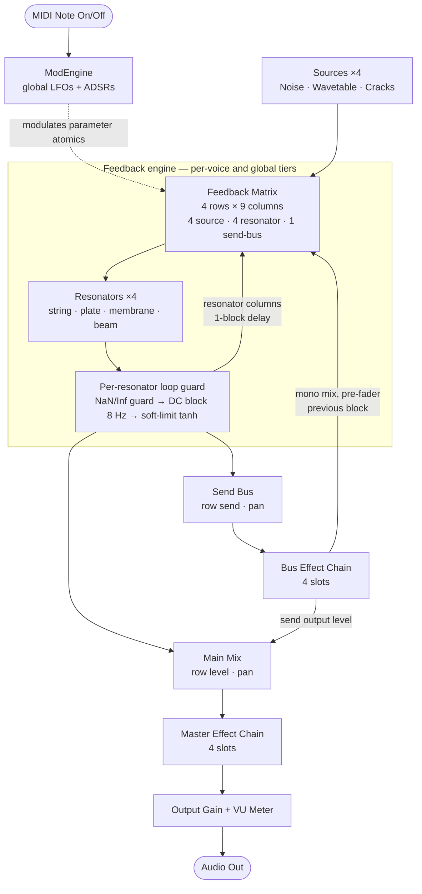
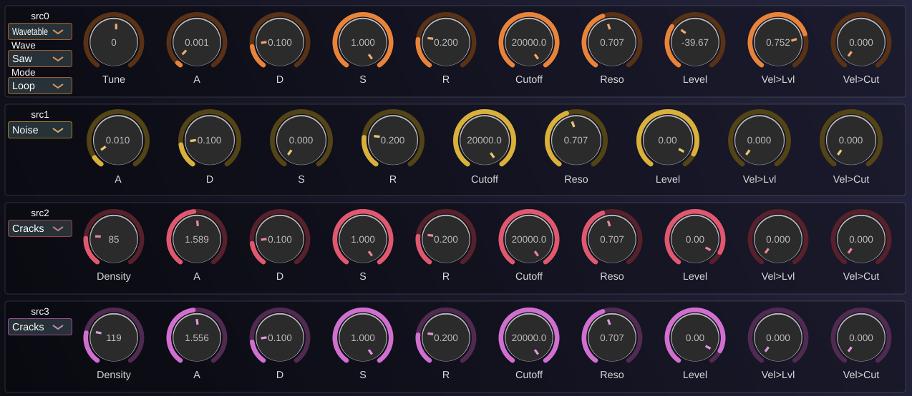
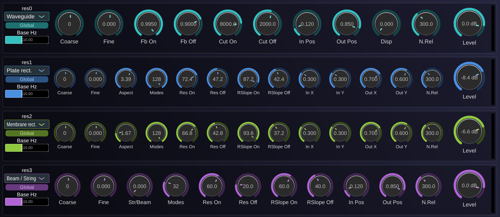
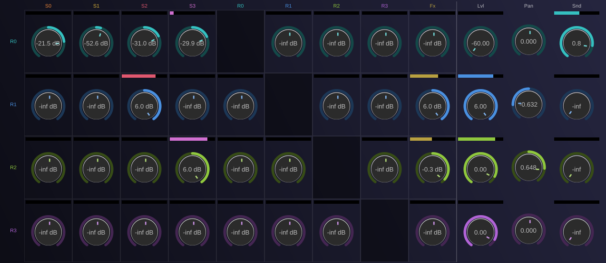
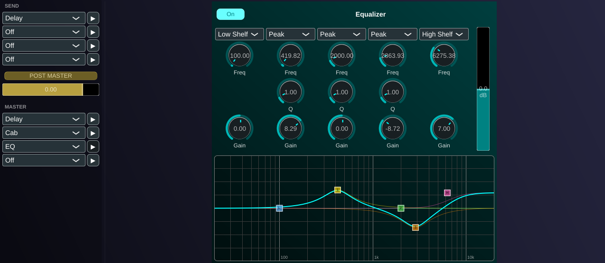
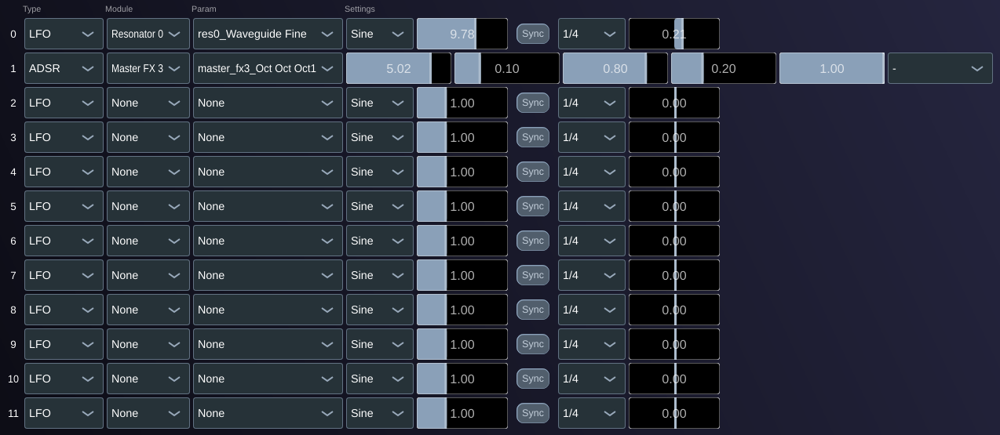

# MechanOdd

**MechanOdd** is a polyphonic physical-modelling synthesizer plugin (VST3/AU) built with JUCE. It synthesizes sound by exciting simulated mechanical resonators (strings, plates, membranes, and beams) and routing the results through a feedback matrix, effects chains, and a modulation engine.

---

## Table of Contents

1. [Concept](#concept)
2. [Signal Flow](#signal-flow)
3. [User Interface](#user-interface)
   - [Sources](#sources)
   - [Resonators](#resonators)
   - [Feedback Matrix](#feedback-matrix)
   - [Effects](#effects)
   - [Modulation](#modulation)
   - [Bottom Bar](#bottom-bar)
4. [Resonators: DSP and Mathematics](#resonators-dsp-and-mathematics)
   - [Waveguide String](#waveguide-string)
   - [Plate](#plate)
   - [Membrane](#membrane)
   - [Beam / String (Modal)](#beam--string-modal)
5. [Feedback Matrix: Routing and Gain Encoding](#feedback-matrix-routing-and-gain-encoding)
6. [Modulation Engine](#modulation-engine)
7. [Effects](#effects-1)
8. [Building](#building)

---

## Concept

MechanOdd is built around the idea that interesting timbres arise from the **interaction** between excitation signals and resonant structures, rather than from either alone.

A typical path through the synth:

1. **Sources** generate raw signals (noise bursts, wavetable oscillators, crackling textures).
2. **Resonators** shape those signals using models of physical objects: a vibrating string, a struck plate, a drum membrane, a stiff beam.
3. A **feedback matrix** lets resonators feed back into each other and into the sources, creating coupled systems with complex emergent behaviour.
4. **Effects** polish the result (reverb, delay, EQ, saturation, cabinet simulation).
5. A **modulation engine** (LFOs + per-voice ADSRs) animates any parameter over time.

The synth is fully polyphonic (up to 8 voices). Each voice runs its own set of sources, per-voice resonators, and a modulation engine. A second tier of **global resonators** receives the summed output of all voices and processes it once per audio block, suitable for room-scale resonances shared across notes.

---

## Signal Flow

The full routing (the feedback paths, the resonator columns and the re-entrant send-bus column and the per-resonator safety stage) is shown below. See [doc/AUDIO_ROUTING.md](doc/AUDIO_ROUTING.md) for the annotated version.



The **one-block feedback delay** between the matrix output and the resonator (and send-bus) inputs is inherent to the per-block processing model: it keeps the feedback loops stable and avoids circular dependencies within a single block.

Every resonator output also passes through a **loop-safety stage** before it re-enters the matrix or the mix (a NaN/Inf guard, a one-pole DC blocker, and a soft `tanh` limiter) so the matrix cross-feedback and the re-entrant send-bus chain cannot run away or accumulate DC. See [Feedback Matrix: Routing and Gain Encoding](#feedback-matrix-routing-and-gain-encoding).

---

## User Interface

### Sources



Four source slots (coloured orange, gold, rose, magenta) generate the excitation signals. Each slot can be independently tuned and shaped. Typical source types:

- **Wavetable**: band-limited oscillator reading a stored waveform cycle.
- **Noise**: spectrally shaped random signal, useful as a bow or breath approximation.
- **Cracks**: sparse impulse train imitating plectrum picks or percussion strikes.

Sources feed into the columns of the feedback matrix.

### Resonators



Four resonator slots (coloured teal, azure, lime, violet) model the physical structure being "played." Each slot independently selects a resonator type and its associated parameters.

Resonators can run in two modes:
- **Per-voice**: each polyphonic voice gets its own independent resonator instance, tuned to the note's pitch.
- **Global**: a single instance shared across all voices, processed once per audio block.

See [Resonators: DSP and Mathematics](#resonators-dsp-and-mathematics) for the models.

### Feedback Matrix



A 4×9 routing grid. Each cell is a **bipolar gain knob** (centre = mute, edges = ±maximum gain):

- **Columns 1–4** carry the four source signals.
- **Columns 5–8** carry the four resonator outputs (fed back with a one-block delay).
- **Column 9** carries the processed send-bus output, fed back with a one-block delay (the re-entrant send chain).
- **Rows 1–4** feed the four resonators.

Each row also has a **level**, **pan**, and **send** control. The send bus routes signal into the Bus Effect Chain, whose output is both folded into the master mix and fed back into column 9 of the matrix.

### Effects



Two serial effect chains of four slots each:

| Chain | Purpose |
|-------|---------|
| **Bus** | Applied to the send signal accumulated from all voices and resonators. Its output also re-enters the feedback matrix (column 9), forming a re-entrant effect loop |
| **Master** | Applied to the final stereo mix, after the bus chain |

Available effects per slot: Delay, Tube saturation, EQ, Octaver, Compressor, Limiter/maximizer, Transient shaper, Cabinet IR, Convolution Reverb.

### Modulation



Twelve global modulators, each targeting any float parameter in the plugin. Two types:

- **LFO**: continuously oscillating; selectable shape (Sine, Triangle, Square, Saw Up, Saw Down); rate in Hz or tempo-synced to host (1/1 down to 1/16T).
- **ADSR**: triggered by MIDI note gates; global gate rises on the first note after silence, falls on the last note release.

Per-voice ADSRs mirror the global ADSR modulators but track individual note gates, so each voice can have independent envelope shapes even on the same target parameter.

### Bottom Bar


Persistent controls visible on all tabs:

| Control | Range | Description |
|---------|-------|-------------|
| Volume | −60 to +6 dB | Output gain |
| Voices | 1–8 | Polyphony limit |
| Portamento | 0–2000 ms | Pitch glide time between notes |

A stereo peak-hold VU meter shows the output level.

---

## Resonators: DSP and Mathematics

### Waveguide String

**Physical model:** A 1D transverse wave on a lossy, dispersive string, implemented using the **digital waveguide** method (Smith 1992).

#### Structure

Four fractional delay lines form a bidirectional loop:

```
           upA          upB
 Nut ◄────────── * ◄────────── Bridge
  │                               ▲
  │  dnA          dnB             │
  └────────────────────────────► Loop filter
```

- **upA / upB**: right-going wave, split at the input position.
- **dnA / dnB**: left-going wave, split symmetrically.
- The **nut** reflects with sign inversion (rigid termination).
- The **bridge** applies a one-pole low-pass filter and a gain `g`, then inverts (second rigid termination).

#### Loop filter (bridge)

```
y[n] = y[n-1] + α · (x[n] - y[n-1])       (one-pole low-pass)
```

where the coefficient α is derived from the target cutoff frequency `f_c`:

```
ω_c = 2π f_c / f_s
α   = ω_c / (1 + ω_c)                       (bilinear pre-warped)
```

After the filter, the signal is scaled by `−g` (reflection gain, absorption) and fed to the opposite-direction rail.

#### Dispersion (stiffness)

A chain of 8 first-order all-pass sections adds frequency-dependent delay, simulating the dispersion relation of a stiff beam:

```
H_ap(z) = (c + z^−1) / (1 + c·z^−1)        c < 0 for forward-sloping dispersion
```

The all-pass coefficient `c` is derived from the **dispersion** parameter (0 = ideal string, 1 = maximum stiffness). A correction is subtracted from the delay-line lengths so the fundamental pitch remains accurate despite the added all-pass latency.

#### Excitation and readout

The input signal is split equally into the two opposing wave directions (half-force injection):

```
upA.push(0.5 · x[n])
dnB.push(0.5 · x[n])
```

The output is the sum of both rails at the output position tap.

#### Pitch normalisation

Raw feedback gain `g` would make the **T60 decay time** depend on pitch (higher notes decay faster because the round trip is shorter in samples). To correct this, the gain is raised to the power `(f_ref / f)` per round-trip:

```
g_normalised = g^(f_ref / f)
```

Similarly, the loop filter cutoff is scaled by `f / f_ref` so that the spectral shape (harmonic ratio of the cutoff to the fundamental) stays constant across the keyboard.

#### Parameters

| Parameter | Range | Description |
|-----------|-------|-------------|
| fbGain On | 0–1 | Loop reflection gain while note is held |
| fbGain Off | 0–1 | Loop reflection gain after note release |
| fbCutoff On | 200–20 000 Hz | Bridge low-pass cutoff while held |
| fbCutoff Off | 200–20 000 Hz | Bridge low-pass cutoff after release |
| In Position | 0.02–0.98 | Normalised excitation point along string |
| Out Position | 0.02–0.98 | Normalised readout point along string |
| Dispersion | 0–1 | Stiffness / inharmonicity |
| Note Release | 1–10 000 ms | Decay time after note-off |
| Coarse / Fine | ±12 st / ±1 st | Pitch offset |

---

### Plate

**Physical model:** A simply-supported rectangular **Kirchhoff thin plate**, solved modally.

#### Eigenfrequency law

For a plate of aspect ratio `a = b/width` (b = height), the modal frequencies are:

```
f(m, n) = f₀ · (m² + (n/a)²) / (1 + 1/a²)

m, n ∈ {1, 2, 3, …}
```

The denominator normalises so that the (1,1) mode — the lowest — always sits at `f₀` regardless of aspect ratio.

The quadratic dependence on mode indices `m²` and `n²` gives the plate its characteristic **inharmonic, bell-like** spectrum, where higher overtones are increasingly stretched above the harmonic series.

#### Modal shapes (simply-supported)

The amplitude contribution of mode (m, n) at a point (x, y) normalised to the plate dimensions is:

```
φ(m, n, x, y) = 2 · sin(m·π·x) · sin(n·π·y)
```

The factor of 2 normalises peak amplitude to 1 on the unit square.

The **input coupling coefficient** for mode (m, n) at excitation position (x_in, y_in) and output coefficient at (x_out, y_out) are:

```
g_in  = φ(m, n, x_in,  y_in)
g_out = φ(m, n, x_out, y_out)
```

#### Damping

Each mode has its own damping ratio `ζ(m,n)`:

```
ζ(m, n) = ζ₀ + ζ₁ · (f(m,n) / f₀ - 1)
```

- `ζ₀` — base damping (from the **Resonance On/Off** parameter, converted from a linear-dB scale).
- `ζ₁` — frequency-dependent slope (from **Res Slope On/Off**), making higher modes decay faster.

The **Resonance** parameter maps a 0–100 range to damping ratio as:

```
ζ = 10^( (dB_max - dB_value) / dB_range · Δlog )

dB_value = 0   → ζ = 0.1      (heavy damping, very short decay)
dB_value = 100 → ζ = 1×10⁻⁶  (near-undamped, very long ring)
```

On note-on/off the damping crossfades smoothly between the held and released values.

#### Modal filter bank

Each mode is implemented as an **RBJ band-pass biquad** with:

```
Q = 1 / (2·ζ)
f_c = f(m, n)
```

The mode is excited by `g_in · x[n]` and its output is scaled by `g_out`.

#### Gain compensation

Without correction, reducing damping (higher Q) increases peak response but the total energy passed (bandwidth × peak²) stays roughly constant, causing perceived loudness to drop as modes ring longer. A per-mode gain correction restores consistent level:

```
gain_comp(m,n) = sqrt(ζ_ref / ζ(m,n)),    ζ_ref = 0.01
```

clamped to [0.5, 32].

#### Parameters

| Parameter | Range | Description |
|-----------|-------|-------------|
| Modes | 1–128 | Number of active modal filters |
| Res On | 0–100 | Resonance (Q) while note held (linear-dB scale) |
| Res Off | 0–100 | Resonance after note release |
| Res Slope On | 0–100 | Frequency-dependent damping increase while held |
| Res Slope Off | 0–100 | Frequency-dependent damping increase after release |
| Aspect | 1–5 | Plate aspect ratio b/a |
| In X / In Y | 0–1 | Normalised excitation position |
| Out X / Out Y | 0–1 | Normalised readout position |
| Note Release | 1–10 000 ms | Gate release time |
| Coarse / Fine | ±12 st / ±1 st | Pitch offset |

---

### Membrane

**Physical model:** A simply-supported rectangular **ideal membrane** (2D wave equation, zero bending stiffness).

#### Eigenfrequency law

```
f(m, n) = f₀ · sqrt(m² + (n/a)²) / sqrt(1 + 1/a²)

m, n ∈ {1, 2, 3, …}
```

The square-root dependence produces a **denser, more uniform** spectrum than the plate. Modes cluster more tightly, especially for near-square aspect ratios, giving the characteristic sound of drums and timpani.

#### Comparison with the Plate

| Property | Plate | Membrane |
|----------|-------|----------|
| Frequency law | f₀ · (m² + (n/a)²) / norm | f₀ · √(m² + (n/a)²) / norm |
| Overtone spacing | Increasingly stretched | Gradually compressed |
| Character | Bell, metallic | Drum, skin |

Everything else — modal shapes, damping model, gain compensation, biquad implementation — is identical to the Plate resonator. The gain compensation reference is `ζ_ref = 0.02` (slightly higher) and the clamp ceiling is 64 (wider range) to account for the denser mode packing amplifying interference effects.

---

### Beam / String (Modal)

**Physical model:** A 1D pinned-pinned resonator that **morphs continuously** between a flexible string and a stiff Euler-Bernoulli beam.

#### Unified frequency law

```
f(n) = f₀ · n · sqrt( (1 − b) + b · n² )

n ∈ {1, 2, 3, …}
b ∈ [0, 1]  (mix parameter)
```

Special cases:

| b | Model | f(n) |
|---|-------|------|
| 0 | Ideal string | f₀ · n   (harmonic series) |
| 1 | Euler-Bernoulli beam | f₀ · n²  (quadratic series) |
| 0 < b < 1 | Stiff string | Intermediate (stretched partials) |

At b = 0 the mode spacing is uniform (all harmonics are integer multiples of f₀). As b increases, higher modes become increasingly stretched above the harmonic series, going all the way to the quadratic spacing of a stiff bar (xylophone, marimba).

#### Modal shapes (pinned-pinned, 1D)

```
φ(n, x) = sqrt(2) · sin(n·π·x)
```

Normalised so that the root-mean-square over position equals 1.

The coupling and readout coefficients are:

```
g_in  = φ(n, x_in)
g_out = φ(n, x_out)
```

Nodes (zero-crossings of the mode shape) at `x = k/n` for integer k. Placing the input or output at a node of mode n mutes that mode — this is the physical principle behind guitar harmonics and marimba hole placement.

#### Implementation

Uses the same modal filter bank and damping model as the Plate and Membrane resonators. Mode candidates are generated by walking up in n and stopping at the Nyquist frequency.

#### Parameters

| Parameter | Range | Description |
|-----------|-------|-------------|
| Mix | 0–1 | 0 = pure string, 1 = pure beam |
| In Position | 0.02–0.98 | Normalised excitation point |
| Out Position | 0.02–0.98 | Normalised readout point |
| Res On / Off | 0–100 | Resonance (Q) on/off (linear-dB) |
| Res Slope On / Off | 0–100 | Frequency-dependent damping on/off |
| Note Release | 1–10 000 ms | Gate release time |
| Coarse / Fine | ±12 st / ±1 st | Pitch offset |

---

## Feedback Matrix: Routing and Gain Encoding

### Cell gain encoding

Each cell stores a bipolar parameter `v ∈ [−1, +1]`:

- **`v = 0`**: true zero (mute), regardless of the dB scale.
- **`|v| = 1`**: maximum gain (~+6 dB = ×2 linear).
- **Sign**: controls polarity: positive routing preserves phase, negative inverts it.

The mapping from parameter `v` to linear gain is:

```
|v| = 0                    : gain = 0
|v| > 0                    : gain = sign(v) · 10^( k · (|v| - 1) )

k = log10(gainMax / gainMin) / 1.0     (covers −60 dB to +6 dB over |v| ∈ [0, 1])
```

This means turning a cell from dead-centre toward an edge sweeps from silence through unity gain and continues to +6 dB at full deflection, all in a perceptually even dB curve.

### Feedback stability

Because resonator outputs are delayed by one block before re-entering the matrix, the loop gain seen by the feedback path is the product of all cell gains along the path. Keeping individual cells below unity (|v| < 0.5 approximately) tends to keep the system stable; setting them near the edges creates self-sustaining oscillation or deliberate instability — bounded by the loop-safety stage below.

### Loop safety

Every resonator output passes through a fixed safety stage at the single node where it splits into the mix, the feedback column and the one-block delay:

- **NaN/Inf guard**: the resonator input is sanitised and any non-finite output is mapped to 0, so a transient glitch cannot get latched permanently into the feedback state.
- **DC blocker**: a one-pole high-pass (~8 Hz) stops DC from accumulating in the loop and eating headroom.
- **Soft limiter**: a `tanh` curve with ~+12 dBFS of headroom (`ceiling · tanh(x / ceiling)`) bounds the signal. It is essentially linear at normal levels and pulls the effective loop gain below unity once the signal grows large, so the matrix cross-feedback and the re-entrant send chain self-limit (the way a real string or membrane saturates) instead of clipping the DAC. This is the in-loop counterpart to the optional **Limiter** mastering effect available in the effect chains.

### Send-bus feedback column

Column 9 carries the previous block's **processed** send-bus output (a mono mix of the Bus Effect Chain), so time-based effects like delay and reverb can be folded back into the resonators. The mono mix is captured **before** the send output-level fader, so that fader controls only how much send reaches the master — not how much re-enters the feedback loop.

### Column metering

Each column displays a peak-hold level meter showing the signal amplitude entering that column. The meter ballistics jump instantly to the block peak and release slowly (~0.6 s) to remain readable at the GUI frame rate (~30 Hz).

---

## Modulation Engine

### Parameter modulation

All float parameters in the plugin are stored as **atomic values**. The modulation engine reads the base (automation) value, adds the modulator offset, and writes the result back before any DSP reads the parameter. At the end of the block, unmodulated parameters are restored to their base values.

### LFO

```
phase[n] = phase[n-1] + f_lfo / f_s   (mod 1)

Sine:     y = sin(2π · phase)
Triangle: y = 1 - 4·|phase - 0.5|
Square:   y = sign(sin(2π · phase))
Saw Up:   y = 2·phase - 1
Saw Down: y = 1 - 2·phase

output = depth · y
```

Tempo sync divides the host BPM into note-value durations (1/1, 1/2, 1/4, 1/8, 1/16, 1/8T, 1/16T) and sets `f_lfo` accordingly.

### ADSR (global and per-voice)

Standard linear ADSR envelope with sample-accurate gate detection:

```
Attack:  env += 1 / (attack · f_s)     until env ≥ 1
Decay:   env -= (1 - sustain) / (decay · f_s)   until env ≤ sustain
Sustain: env = sustain
Release: env -= sustain / (release · f_s)         until env ≤ 0
```

`output = polarity · amount · env`

The **global** ADSR tracks whether any voice is currently active. The **per-voice** ADSR tracks the individual note gate, so different voices at different stages of their envelope can modulate the same parameter with independent values.

---

## Effects

Effects are processed in two serial chains. Each chain has four slots; each slot is one of:

| Effect | Description |
|--------|-------------|
| **Delay** | Stereo delay with independent L/R times, feedback, and wet/dry mix |
| **Tube** | Soft-clipping saturator modelling tube harmonic distortion |
| **EQ** | Parametric equaliser (multiple bands, freq/gain/Q) |
| **Octaver** | Pitch-shifted copies (up/down octave) mixed with the dry signal |
| **Compressor** | Dynamic range compressor (threshold, ratio, attack, release, makeup) |
| **Limiter** | Look-ahead brickwall limiter / maximizer (drive, ceiling, release) with a final hard ceiling clamp |
| **Transient** | Transient shaper for independent attack and sustain control |
| **Cabinet** | Impulse-response convolution of a guitar speaker cabinet (19 presets) |
| **Reverb** | Convolution reverb (6 room/hall impulse responses) |

The **Bus** chain processes the resonator/voice send bus; its output is folded into the mix **and** fed back into the matrix (column 9), so the send chain is re-entrant. The **Master** chain processes the final stereo output after the bus is mixed in. Placing a **Limiter** at the end of the Master chain gives a final output ceiling.

---

## Building

Prerequisites: JUCE 7, CMake ≥ 3.22, a C++17 compiler.

```bash
cmake -B build -DCMAKE_BUILD_TYPE=Release
cmake --build build --config Release
```

The plugin builds as VST3 and AU (macOS). Plugin binaries are placed in the standard system locations by the JUCE CMake API.
