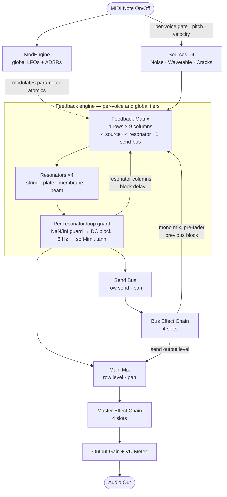

# Audio Routing

This document describes how audio flows through MechanOdd, from MIDI input to
the stereo output, including the two feedback paths (resonator columns and the
re-entrant send-bus column) and the per-resonator safety stage that keeps the
feedback loops bounded.

## Routing graph

## Stages

1. **ModEngine** runs first each block and writes the modulated parameter values
   into the shared atomics, so every module downstream reads already-modulated
   values. Unmodulated parameters are restored to their base value at block end.

2. **Sources** generate the excitation signals and enter the matrix as its first
   four columns. Each MIDI note gates and tunes them per voice: `startNote`
   triggers every source slot's envelope (with velocity) and sets its pitch,
   `stopNote` releases them. (The same note pitch also retunes the resonator
   slots.)

3. **Feedback Matrix** is a 4×9 routing grid. Its columns are the four sources,
   the four resonator outputs (fed back with a one-block delay), and one
   **send-bus feedback** column carrying the previous block's processed bus
   output. Its four rows each drive one resonator with a weighted sum of all
   columns. The matrix runs in two roles that share the same gains: a *per-voice*
   instance (sample-accurate, one per polyphonic voice) and a *global* instance
   (run once per block, after all voices, for resonances shared across notes).

4. **Resonators** transform the matrix input into their output (string, plate,
   membrane, beam/string).

5. **Loop guard** — applied to every resonator output at the single node where it
   splits into the mix, the feedback column and the one-sample delay:
   - the resonator **input** is sanitized so a stray NaN/Inf can never latch into
     its internal state;
   - a one-pole **DC blocker** (~8 Hz) removes any DC that would otherwise
     accumulate in the feedback loop and eat headroom;
   - a **soft tanh limiter** (ceiling ≈ +12 dBFS) bounds the signal so the matrix
     cross-feedback cannot run away — it is ~linear at normal levels and pulls the
     effective loop gain below unity once the signal grows, the way a real string
     or membrane saturates. It also maps any non-finite value to 0.

6. **Main Mix / Send Bus** — each matrix row mixes its (guarded) resonator output
   to the main output through its *level* and *pan*, and to the send bus through
   its *send* and *pan*.

7. **Bus Effect Chain** processes the send bus. Its output is then used twice:
   - a **mono mix is captured pre-fader** and fed back into the matrix on the next
     block as the send-bus column — so the **send output level controls only how
     much reaches the master, not how much re-enters the feedback loop**;
   - the levelled (post-fader) signal is folded into the main mix.

   When *Bus Post Master* is enabled the bus chain runs after the master chain so
   it is not coloured by the master processing; otherwise the bus output is folded
   in before the master chain.

8. **Master Effect Chain → Output Gain → VU Meter → Audio Out** finish the signal.

> The one-block feedback delay on the resonator and send-bus columns is inherent
> to the per-block processing model: it breaks the circular dependency within a
> single block and keeps the loop stable.
