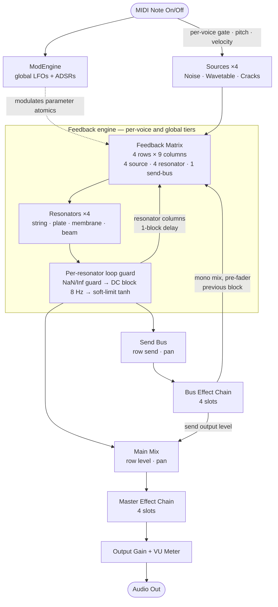

```mermaid
flowchart TD
    MIDI([MIDI Note On/Off]) --> MOD[ModEngine<br/>global LFOs + ADSRs]
    MOD -. modulates parameter atomics .-> MTX

    MIDI -- "per-voice gate · pitch · velocity" --> SRC
    SRC[Sources ×4<br/>Noise · Wavetable · Cracks] --> MTX

    subgraph LOOP[Feedback engine — per-voice and global tiers]
        MTX[Feedback Matrix<br/>4 rows × 9 columns<br/>4 source · 4 resonator · 1 send-bus] --> RES[Resonators ×4<br/>string · plate · membrane · beam]
        RES --> GUARD[Per-resonator loop guard<br/>NaN/Inf guard → DC block 8 Hz → soft-limit tanh]
        GUARD -- "resonator columns<br/>1-block delay" --> MTX
    end

    GUARD --> MIX[Main Mix<br/>row level · pan]
    GUARD --> SEND[Send Bus<br/>row send · pan]

    SEND --> BUSFX[Bus Effect Chain<br/>4 slots]
    BUSFX -- "mono mix, pre-fader<br/>previous block" --> MTX
    BUSFX -- "send output level" --> MIX

    MIX --> MASTERFX[Master Effect Chain<br/>4 slots]
    MASTERFX --> OUTG[Output Gain + VU Meter]
    OUTG --> AOUT([Audio Out])
```
